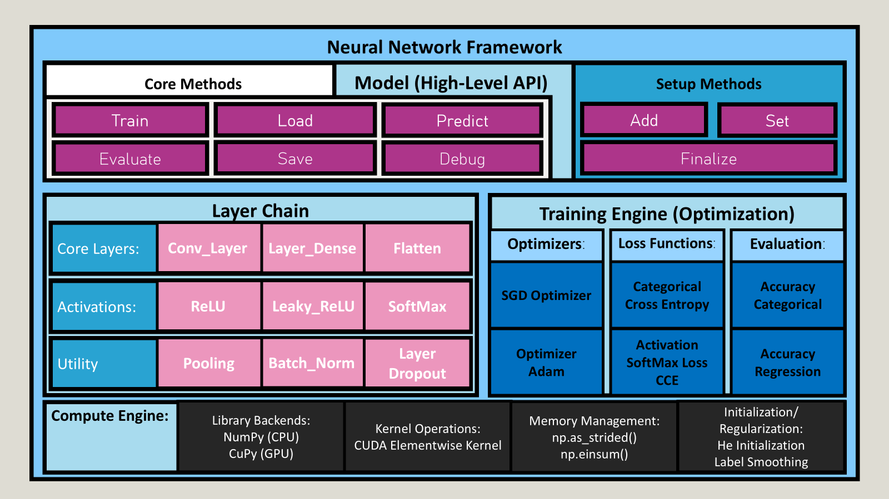
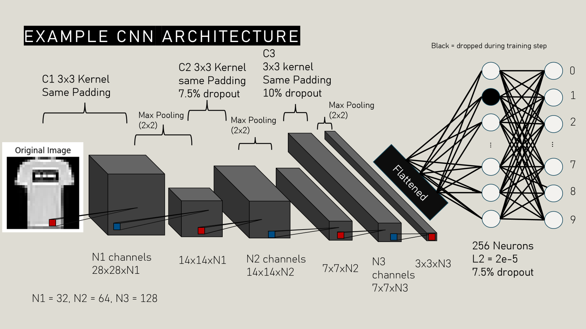
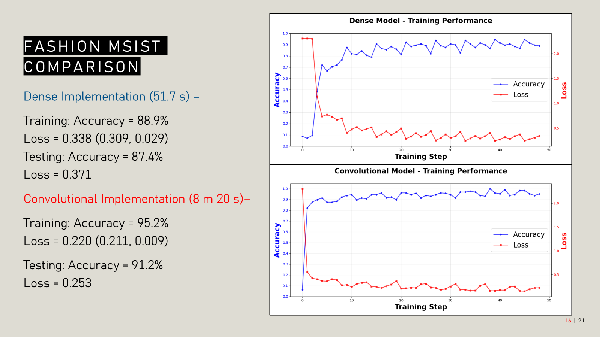

## A Ground-Up Neural Network Framework With Convolutional Support

This project implements a custom neural network framework built from the ground up, without relying on existing deep learning libraries. The framework supports fully connected and convolutional models, manual forward and backward propagation, and CPU/GPU execution using NumPy and CuPy. The goal of the project is to explore the underlying mechanics of modern neural networks through explicit, low-level implementations. The framework and example models were tested using the Fashion-MNIST, and CIFAR-10 datasets. Use of the _Neural Networks from Scratch in Python_ book by Harrison Kinsley & Danial Kukieła was used in creating this project.  

## Key Features
Below are the core components currently implemented: 

- [x] **Manual implementation of forward and backward propagation**
- [x] **Adam optimizer (Kingma & Ba)**
- [x] **Batch Normalization (Ioffe & Szegedy)**
- [x] **Creation of CNN layers using `np.einsum` and `np.as_strided`**
- [x] **He initialization (He et al.)**
- [x] **Label Smoothing within cross entropy loss (Guo et al.)**
- [x] **Layer abstraction via `Model` class**
- [x] **Prediction using `Model.predict` method**
- [x] **Supporting notebooks covering theory and implementations of each CNN component**

## Custom Framework Diagram



The diagram above illustrates the design of the framework. The project is structured around a central `Model` **class** that acts as an orchestrator for the all major components.  

## Example CNN Architecture

The diagram below demonstrates an example convolutional neural network constructed via the framework, incorporating convolutional layers, pooling, flattening, dropout, and fully connected classification.



## Performance: Fashion-MNIST Benchmark 



**Analysis**: While the CNN takes significantly longer to train(reflecting complexity of manual einsum operations), a prominent +3.8% boost in generalization is shown on the testing set, compared to a MLP architecture. This slowdown is due to the implementation of `Conv_Layer` and `Pooling`. Both models were trained on an NVIDIA RTX 3050 Mobile using CuPy backend


## Installation and usage instructions for end-users

```bash
# Clone the repository
git clone https://github.com/AlexanderSoftCode/Aether-ML.git
cd Neural-Network

# Create a virtual environment (optional but recommended)
python -m venv .venv
venv\Scripts\activate 

#Install dependencies
pip install -r requirements.txt
```


## Usage Example: Testing a Pre-trained CNN
<details> 
<summary> Click to view the full CuPy implementation</summary>

```python
import cupy as cp
import numpy as np
import time
import matplotlib.pyplot as plt
from CNN.models.CNN_model_cupy import *


with cp.load("data/cifar10_train.npz") as data:
    X, y = data["X"], data["y"]
    
with cp.load("data/cifar10_test.npz") as data:
    X_test, y_test = data["X"], data["y"]


model = Model()

#Add the first convolutional block
model.add(Conv_Layer(input_shape = (32, 32, 3), num_filters= 32, filter_size= (3, 3), strides= (1, 1),
                     padding= "same"))
model.add(Batch_Norm(epsilon = 1e-5, momentum= 0.9))
model.add(ReLU())
model.add(Pooling(filter_size= (2,2), strides = (2,2), padding = "valid", pooling_type= "max"))

#Add the second convolutional block
model.add(Conv_Layer(input_shape = (16, 16, 32), num_filters= 64, filter_size= (3, 3), strides= (1, 1),
                     padding= "same"))
model.add(Batch_Norm(epsilon = 1e-5, momentum= 0.9))
model.add(ReLU())
model.add(Layer_Dropout_Spatial(rate = 0.075))
model.add(Pooling(filter_size= (2,2), strides = (2,2), padding = "valid", pooling_type= "max"))

#Add a final convolutional block
model.add(Conv_Layer(input_shape= (8, 8, 64), num_filters = 128, filter_size= (3, 3), strides = (1, 1),
                     padding = "same"))
model.add(Batch_Norm(epsilon = 1e-5, momentum= 0.9))
model.add(ReLU())
model.add(Layer_Dropout_Spatial(rate = 0.1))
model.add(Pooling(filter_size= (2, 2), strides = (2, 2), padding = "valid", pooling_type = "max"))

#Flatten and use dense layers
model.add(Flatten())
model.add(Layer_Dense(4 * 4 * 128, n_neurons= 256, weight_regularizer_l2= 2e-5, bias_regularizer_l2= 2e-5))
model.add(Leaky_ReLU(alpha = 0.01))
model.add(Layer_Dropout(rate=0.075))
model.add(Layer_Dense(256, 10))
model.add(SoftMax())

model.set(
    loss = Loss_CategoricalCrossEntropy(label_smoothing= 0.01),
    optimizer = Optimizer_Adam(learning_rate = 0.001, decay = 5e-5),
    accuracy = Accuracy_Categorical()
)

model.finalize()


model.load_parameters(path = "CNN/saved_models/cifar1")

model.evaluate(X_val = X_test, y_val = y_test, batch_size= 128)
```
</details>

## Known Issues

Note: Due to the inclusion of `cp.ElementwiseKernel`, the functionality of `model.save` and subsequently `model.load` will not work. Please recreate the architecture and instead use `model.load_parameters` instead.

* **The Fix**: Consider using the `model.save_parameters` method that extracts only the parameters, and setup the same architecture used during training to perform prediction or evaluation (as shown in the codeblock above). 

## References

* Book: Kinsley, H., & Kukieła, D. (2020). _Neural Networks from Scratch in Python_ (NNFS).

* Adam Optimizer: Kingma, D. P., & Ba, J. (2014). _Adam: A Method for Stochastic Optimization_. arXiv preprint arXiv:1412.6980.

* Batch Normalization: Ioffe, S., & Szegedy, C. (2015). _Batch Normalization: Accelerating Deep Network Training by Reducing Internal Covariate Shift_. In International Conference on Machine Learning (pp. 448-456).

* He Initialization: He, K., Zhang, X., Ren, S., & Sun, J. (2015). _Delving Deep into Rectifiers: Surpassing Human-Level Performance on ImageNet Classification_. In Proceedings of the IEEE International Conference on Computer Vision (pp. 1026-1034).

* Label Smoothing: Guo, C., Pleiss, G., Sun, Y., & Weinberger, K. Q. (2017). _On Calibration of Modern Neural Networks_. In Proceedings of the 34th International Conference on Machine Learning-Volume 70 (pp. 1321-1330).
